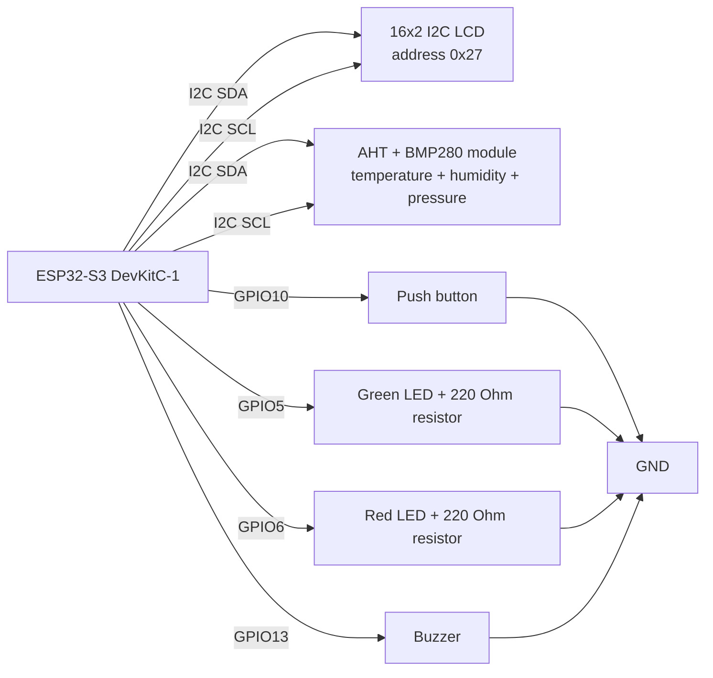

# Meteo32

`Meteo32` is firmware for a small indoor weather station based on the **ESP32-S3 DevKitC-1**.

The device measures temperature, humidity, and atmospheric pressure, shows the readings on a 16x2 I2C LCD display, and triggers an alarm when one of the measured values goes outside the configured safe range.

The project is written for the **Arduino framework** and is built with **PlatformIO** in Visual Studio Code.

## How It Works

After power-up, the ESP32 starts the LCD display, shows a loading animation, and initializes the connected modules.

The project uses one combined sensor module:

- **AHT + BMP280 module**:
  - AHT measures temperature and humidity.
  - BMP280 measures atmospheric pressure.

The combined sensor module works over the **I2C bus**. The LCD display is also connected over I2C.

After reading the sensors, the firmware applies calibration offsets:

- temperature: `-1.2 C`
- humidity: `-1 %`
- pressure: `+10.9 hPa`

Then the measured values are compared with the configured limits:

| Measurement | Minimum | Maximum |
|---|---:|---:|
| Temperature | `19.0 C` | `26.0 C` |
| Humidity | `20 %` | `80 %` |
| Pressure | `1000 hPa` | `1015 hPa` |

If all values are within range, the device stays in normal operation. The LCD can be turned on with the button to check the current readings.

Example LCD output:

```text
 T:23.4C  H:45%
 P:1008hPa
```

If a value is outside the allowed range, the firmware marks it with `*`:

```text
*T:27.1C  H:45%
 P:1008hPa
```

The same measurements are also printed to Serial Monitor.

## Operating Modes

### Standby

In standby mode, the LCD is turned off. The green LED gives a short blink about once every 20 seconds to show that the device is powered and running.

### Active

Active mode turns on the LCD and displays the current temperature, humidity, and pressure. This mode is activated by pressing the button. After a short time, the display turns off again.

### Alarm

Alarm mode starts when temperature, humidity, or pressure goes outside the configured limits.

In alarm mode:

- the red LED blinks;
- the buzzer beeps;
- the LCD marks the problematic value with `*`;
- readings are printed to Serial Monitor.

The button can be used to silence the alarm temporarily. After pressing it, the firmware starts an alarm cooldown period of about 1 hour.

## Required Hardware

- **ESP32-S3 DevKitC-1**
- **combined AHT + BMP280 sensor module**
- **16x2 I2C LCD display**, configured address: `0x27`
- Push button
- Green LED
- Red LED
- Buzzer
- **220 Ohm resistor for the green LED**
- **220 Ohm resistor for the red LED**
- Jumper wires
- Breadboard or soldered prototype board
- USB cable for flashing the ESP32
- Stable power supply

## Wiring Diagram



## Pinout

Pins defined in the firmware:

| Component | ESP32-S3 pin |
|---|---:|
| Button | `GPIO10` |
| Green LED | `GPIO5` |
| Red LED | `GPIO6` |
| Buzzer | `GPIO13` |

I2C modules:

| Module | Connection |
|---|---|
| LCD 1602 I2C | SDA/SCL on the ESP32 I2C bus |
| AHT + BMP280 module | SDA/SCL on the ESP32 I2C bus |

All modules must share a common `GND`.

The current firmware does not explicitly set custom I2C pins with `Wire.begin(SDA, SCL)`, so the I2C pins are taken from the selected ESP32-S3 board configuration. If you want to use fixed I2C pins, define them in the code and call `Wire.begin(SDA_PIN, SCL_PIN)` before initializing the sensors and LCD.

## Connection Notes

- The button is expected to pull the input to `GND` when pressed.
- Each LED should be connected through a `220 Ohm` current-limiting resistor.
- If the buzzer requires more current than a GPIO pin can safely provide, use a transistor driver.
- Many I2C modules can work at `3.3V`, but some LCD I2C backpacks are designed for `5V`. Check your exact modules before wiring power.
- Keep all `GND` lines connected together.

## Libraries

The project uses these PlatformIO dependencies:

```ini
adafruit/Adafruit AHTX0
adafruit/Adafruit BMP280 Library
adafruit/Adafruit Unified Sensor
adafruit/Adafruit BusIO
marcoschwartz/LiquidCrystal_I2C
```

## Project Structure

```text
.
├── include/        # Header files
├── lib/            # Local project libraries
├── src/
│   └── main.cpp    # Main firmware source code
├── test/           # PlatformIO tests
├── platformio.ini  # Board and library configuration
└── README.md
```

## Build and Upload

Open the project in **Visual Studio Code** with the **PlatformIO IDE** extension installed.

Build the project:

```bash
pio run
```

Upload firmware to the ESP32:

```bash
pio run --target upload
```

Open Serial Monitor:

```bash
pio device monitor
```

Serial Monitor speed:

```text
115200
```

## ESP Board Configuration

The `platformio.ini` file uses this environment:

```ini
[env:esp32-s3-devkitc-1]
platform = espressif32
board = esp32-s3-devkitc-1
framework = arduino
monitor_speed = 115200
```
